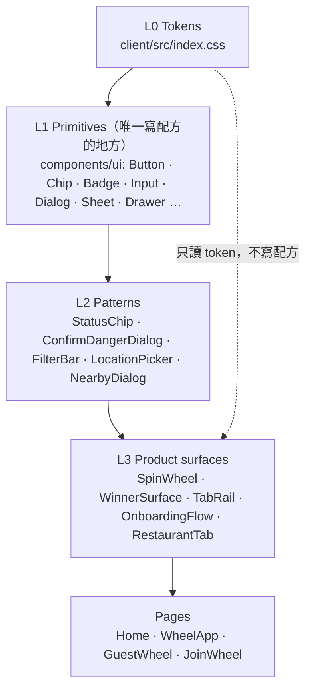

# Lunch Wheel 設計系統 — Ember

> 狀態：Phase 1 已落地（2026-09-23，branch `claude/design-system-tokens-o1ontc`）
> 活的參考頁：**`/design-system`**（部署後的網址直接打這個路徑；不在任何選單裡）

這份文件回答四件事：**設計系統由哪幾層組成、每一層的單一真相在哪、這一輪改了什麼、接下來要業主決定什麼。**
數值本身不在這裡 —— 在 `client/src/index.css`，旁邊的註解就是每個數值的決策紀錄。這份文件只描述結構與規則。

| 要找的東西 | 唯一真相 |
|---|---|
| 顏色、字級、圓角、動態、元件尺寸（token） | `client/src/index.css` |
| 元件的「配方」（一顆按鈕長什麼樣） | `client/src/components/ui/*` |
| 看得到、量得到的參考 | `/design-system`（`client/src/design-system/StyleGuide.tsx`） |
| 自動守門（對比、token 存在、配方外流） | `client/src/design-system/*.test.ts`（跑在 `pnpm test`） |
| 刻意低於 AA 的配對與原因 | `client/src/design-system/pairs.ts` |

---

## 1. 研究：成熟的設計系統怎麼分層，我們拿什麼、不拿什麼

參考對象：Material 3（ref → sys → comp 三層 token）、W3C Design Tokens Community Group 格式（DTCG）、GitHub Primer 與 Atlassian（語意命名 + CI 對比檢查）、Shopify Polaris（元件 API 以「角色」命名而非外觀）、Adobe Spectrum（「token 是決策，不是數值」）、shadcn/ui（CSS 變數 + 複製進 repo 的元件）。

它們的共識可以濃縮成三句：

1. **Token 分三層**：原始值（primitive：`#DE5C1F`）→ 語意（semantic：`--brand`，說這個顏色「用來做什麼」）→ 元件（component：`--control-lg`，說某個元件「由什麼組成」）。畫面只碰後兩層。
2. **元件以角色命名**：`variant="primary"`、`"destructive"`，不是 `"orange"`、`"red"`。換皮時改配方，不改呼叫端。
3. **規則要能被機器檢查**：對比、token 存在、配方不外流，都放進 CI；文件會過期，測試不會。

我們的取捨：

| 做法 | 採用？ | 理由 |
|---|---|---|
| 語意命名 + 元件 token | ✅ | 語意層原本就有（Ember 那一輪建立的）；**缺的是元件層**，這輪補上 |
| 原始色票拆成獨立 CSS 變數（`--persimmon-500`） | ❌ 暫不 | 只有兩個主題、每個值只被用一次；多一層間接卻沒有第二個使用者。色票以表格形式記在本文件 §3.1 |
| DTCG JSON + Style Dictionary 產生 CSS | ❌ 暫不 | 只有一個平台（web）；而且 `index.css` 的註解就是設計決策紀錄（失敗模式 17、20、26…），產生出來的檔案會把它們丟掉 |
| Storybook | ❌ | 重的依賴、另一套建置、會和實際 app 漂移。改用 **app 內的 `/design-system` 路由**：渲染的就是 app 用的元件、讀的是瀏覽器實際解析的 token，lazy chunk，入口 bundle 零成本 |
| CI 對比檢查 | ✅ | 失敗模式 17 的教訓：柿子橘的 3.48:1 是 12 個 build item 之後才被量到的 |
| 遷移用「棘輪」（ratchet）而非一次禁用 | ✅ | 大型 codebase 常見的漸進採用法：剩下的數量只能變少，新增一個就測試失敗 |

---

## 2. 現況稽核（2026-09-23，實測 / grep）

Ember 那一輪把**顏色**做成了 token，但沒有做**元件**。結果是配方被抄進每個呼叫端：

| 項目 | 稽核時 | 這輪之後 |
|---|---|---|
| 手寫 `minHeight: 56` | 38 處 | **13 處** —— 剩下的是列表列、玻璃 bar 上的 icon 鈕、結果頁的玻璃按鈕（Phase 2） |
| 手寫的 `<button>` / `<a>` 按鈕配方 | 27 個 + 17 個用 inline style 蓋掉的 `<Button>` | 全部走 `components/ui`，呼叫端只剩版面 utility |
| 行內 `background: var(--brand-grad)` | 39 處 / 17 個檔案 | **8 處 / 7 個檔案**（全是裝飾：tab 指示條、勾選方塊、頭像），測試鎖住只能變少 |
| shadcn `<Button>` | 原廠 36px、6px 圓角、`bg-primary`；17 處使用，**每一處都用 inline style 蓋掉** | 重寫成 Ember 配方，呼叫端只選 variant/size |
| 可互動元件高度 | 7 種（32/36/40/44/48/56/64） | 2 種：56（動作）、44（精簡 / 點擊下限）；64 的 commit bar 為特例 |
| 按鈕字級 / 字距 / disabled 透明度 | 14/15/16/17px；0 / 0.04 / 0.05em；0.4 / 0.5 / 0.55 | 16（實心動作）/ 15（其他）；0.05em（只給 primary）；0.4 |
| Lucide icon 尺寸 | **15 種**（10–48px） | 未動 —— Phase 3 |
| 行內 `style={{…}}` / TSX 裡的 `var(--…)` | 401 / 827 | 364 / 638；語意色都有 utility 了（`text-ink-warm` 等），其餘 Phase 2 清 |
| `--ink-warm` | 註解寫「只用於輪盤標籤」，實際 101 處 | 註解改為實況；是否成為唯一墨色 → 待決 D1 |
| 死 token | `--color-chart-1..5`（其中 3 個是飽和色，違反「柿子橘是唯一飽和色」）、`--brand-glow`、`--glass-highlight`、`--ease-decay` | 刪除。`--ease-decay` 還存著失敗模式 45 已淘汰的曲線，和 `shared/wheelGeometry.ts` 的 `EASE_DECAY` 互相矛盾（BACKLOG 4a） |
| Tailwind `dark:` | 跟著**作業系統**的深淺色，不是 app 的切換 | 改為跟 `.dark` class（`@custom-variant dark`）。OS 深色、app 選淺色的人，輸入框底色原本是錯的 |
| `cn()` 的 tailwind-merge | 不認得 `rounded-control` 等自訂圓角 → `cn("rounded-control", "rounded-full")` 兩個都留 | 教它認得 4 個 `--radius-*` |

**量到、但不屬於這輪要決定的事實**（對比，WCAG 2.x）：

| 配對 | 淺色 | 深色 | 狀態 |
|---|---|---|---|
| CTA 文字 on 漸層**淺端** `--brand-2` | **2.35:1** | 8.31:1 | 待決 D2 —— 失敗模式 20 量的是「平塗」柿子橘的 3.48，漸層（失敗模式 26）回來之後淺端沒人量過 |
| `--muted-foreground` on 地面 `--background` | **4.30:1** | 6.82:1 | 待決 D3 |
| 髮絲線 `--border` 作為輸入框唯一邊界 | **1.53:1** | 1.25:1 | 待決 D4（WCAG 1.4.11 要 3:1） |
| 柿子橘文字、CTA on 平塗柿子橘、星星填色 | 3.48 / 3.05 / 1.53 | ✅ | 已接受（業主決定，失敗模式 20） |

---

## 3. Token 架構

```
原始值（palette）      語意（semantic）            元件（component）          Tailwind utility
#DE5C1F  ─────────▶  --brand, --brand-solid  ─▶  （由元件引用）          ─▶  bg-(image:--brand-grad)
#2E2A27  ─────────▶  --ink-warm              ─▶                          ─▶  text-ink-warm
56px     ─────────────────────────────────────▶  --control-lg            ─▶  min-h-(--control-lg)
```

### 3.1 原始色票（記錄用，不是變數）

| 家族 | 淺色 | 深色 |
|---|---|---|
| Persimmon | `#DE5C1F` → `#F0894A`（漸層）；`#C04F18`（34px+ 標題） | `#F2703A` → `#F79463` |
| Paper / Ground | `#FBF7F2`、`#F6F2EC → #EFE8DF → #E7DED2` | `#1E2127`、`#191B20 → #15171C → #101216` |
| Ink（冷） | `#0D0F14`、`#14161C`、`#5A626D`、`#666D77`、`#9AA1AA` | `#FCFAF7`、`#F6F3EE`、`#E6E2DB`、`#9BA0A8`、`#7C838C` |
| Ink（暖） | `#2E2A27`、`#6F6862` | `#F2EDE8`、`#A8A29E` |
| Hairline | `#C7CBD1` | `#2E323A` |
| Semantic | 紅 `#B3261E`、綠 `#2F6B4F`、資訊 `#7A5B33`、星 `#FFC107` / `#96650F` | `#E5654F`、`#6FBF95`、`#C9A97A`、`#FFC94A` |

### 3.2 語意 token（`:root` / `.dark`）

以「用途」命名。幾個反直覺但刻意的名字（沿用 shadcn 的語意，改名會牽動所有 primitives）：

- `--muted`、`--accent` 是**淺色面板 / hover 底色**，不是灰色文字或柿子橘。灰字是 `--muted-foreground`，柿子橘是 `--brand`。
- `--brand-grad` 是**所有柿子橘背景**；`--brand-solid` 是柿子橘作為**顏色**（邊框、SVG —— 它們吃不了漸層）；`--brand-text` 是柿子橘**文字**。三者在淺色目前同值，但角色不同，未來可以分開調。

每個語意色都有對應的 Tailwind utility（`text-ink-warm`、`border-brand-solid`、`bg-ok/15`…），新程式碼不需要再寫 `style={{ color: "var(--…)" }}`。

### 3.3 元件 token（新）

| Token | 值 | 用途 |
|---|---|---|
| `--control-lg` | 56px | 一個「動作」（規格 §1 的最小控制高度）；列表列 |
| `--control-md` | 44px | 精簡動作、chip、輸入框、輸入框旁的按鈕 —— 點擊目標下限 |
| `--control-label-lg` / `-md` | 16 / 15px | 實心動作（primary、destructive）高一階；其他在 meta 階 |
| `--control-tracking` | 0.05em | 只給 primary 的字距 |
| `--control-disabled-opacity` | 0.4 | 唯一的 disabled 處理 |
| `--badge-height` / `--badge-label` | 18px / 11px | 計數徽章 |

圓角**依「是什麼」決定，不依大小**：按鈕、輸入框 → `--radius-control`（22）；chip、badge → `--radius-chip`（19）；卡片 28；sheet 34。

### 3.4 新增 / 修改 token 的流程

1. 先問：這是新的**用途**，還是既有用途的新**值**？後者只改值。
2. 新語意色 → 在 `:root` 和 `.dark` 都定義，並在 `@theme inline` 加 `--color-*` 對應，才有 utility。
3. 任何會被當文字或邊界的不透明色 → 加進 `pairs.ts`。低於標準就必須寫成 `accepted`（業主看過）或 `open`（待決），並附原因。
4. 加進 `catalog.ts`，`/design-system` 才看得到；測試會檢查名稱真的存在。
5. 到 `/design-system` 切深淺色實際看一次（失敗模式 17：量到的是事實，決定要看畫面）。

---

## 4. 元件架構



規則：**配方只寫在 L1。** L2 以上只能選 variant / size，版面用 utility（`w-full`、`px-8`、`gap-2.5`）。找不到合適的 variant → 在 L1 加一個，不在呼叫端加 `style`。

### 4.1 Button

| variant | 什麼時候用 | 例子 |
|---|---|---|
| `primary` | 這個畫面唯一的柿子橘動作 | 轉、加入、儲存、登入 |
| `secondary` | 地面（非玻璃）上的次要動作：實心紙 + 髮絲線 | 「手動新增」、「複製這個輪盤」 |
| `outline` | **玻璃上**的動作：只有髮絲線（失敗模式 35：玻璃上不能疊半透明面板） | sheet 內的「編輯」、對話框的「取消」 |
| `brand-outline` | 仍屬品牌的次要動作，常在輸入框旁 | Landing 的「加入」 |
| `ghost` | 最安靜的退路 | 「其他方式」 |
| `positive` | 把東西放回來 | 「重新啟用」 |
| `destructive` | 確認刪除（對話框裡的主要動作） | 「刪除」 |
| `destructive-outline` | 提供刪除（離確認還有一步） | 店家詳情的「刪除」 |
| `link` | 行內文字連結 | |

尺寸：`lg`（56，預設）、`md`（44）、`icon`（44×44，icon 固定 16）、`icon-lg`（56×56，icon 固定 20）。

**有紀錄的例外**（用 token 或 utility 覆寫，並在程式碼旁註明原因）：

- Landing 的兩個 CTA 用 `font-semibold`（行銷頁強調；待決 D5）。
- 結果頁「就吃這家」17px semibold、無字距 —— 整個 app 存在的理由，比其他 primary 再高一階。
- Places 標題列的「附近」用 15px（和「新增」共用 360px 手機的一列）。
- 轉盤的 Spin 在「用完 / 沒有候選」時變灰（`bg-none bg-muted`），不是淡柿子橘 —— GuestWheel 同樣處理（待決 D7：是否成為所有 disabled primary 的樣子）。

### 4.2 Chip、Badge

- **Chip**：可見狀態的切換。關 = 描邊，開 = 柿子橘漸層。`pressed` 同時決定外觀和 `aria-pressed`，螢幕閱讀器聽到的和畫面上的不可能不一致（Filter sheet 的 chip 原本只有顏色沒有屬性）。
- **Badge**：只放數字。`sm`（18px、11px 字，放在控制元件角落）、`md`（meta 字級，放在區塊標題旁）。

### 4.3 下一批候選（Phase 2）

| 候選 | 目前狀況 |
|---|---|
| `Button variant="glass"`（玻璃 bar 上的 icon 按鈕） | FilterTrigger、設定鈕各自寫 `glass-bar` + 56×56 |
| WinnerSurface 的 `GHOST_ON_GLASS` | 深色模式也用 `rgb(255 255 255 / .34)` —— 值得檢查 |
| `ListRow`（56px 可點列） | WheelSelector、NearbyDialog、LocationPicker 各一版 |
| `Avatar` / monogram | WheelApp 帳號、WheelMembers |
| `Field`（輸入框 + 動作） | 目前靠兩者都是 44 才對齊 |
| Select / Textarea / Switch 高度 | 仍是 shadcn 原廠值 |
| 行內 `var(--…)` → utility | ~450 處；可加第二個棘輪測試 |
| `text-sm`（56 處）→ `type-meta` | 14px 不在 Ember 字級上 |

---

## 5. Asset 架構

| 資產 | 真相來源 | 產出 / 位置 | 規則 |
|---|---|---|---|
| 品牌標誌（mark） | `.orb-wheel`（CSS，index.css） | 頁首、Loader、rail | 就是休息中的輪盤縮小版；**在實際看到的尺寸檢查**（失敗模式 19：24px 只剩楔形和外框） |
| Favicon | `client/public/icon.svg`（圓） | 瀏覽器分頁 | 16px 仍可讀 |
| PWA / iOS icon | `icon-maskable.svg`（滿版，圖在 80% 安全圓內） | `icon-192/512.png`、`apple-touch-icon.png` | PNG 用 `headless_shell` 產生（失敗模式 63：`chrome --headless` 的視窗尺寸會把圖墊邊） |
| 分享預覽 | og 圖 | `og.png` | 中文字型子集由**文案本身**導出，不手打字表（失敗模式 64） |
| 字型 | Bricolage Grotesque（自架 woff2 ×3 subset） | `client/public/fonts/` | 中文走系統字型鏈，不自架 CJK |
| 圖示 | lucide-react | — | 目前 15 種尺寸 → 提案縮成 12 / 16 / 20 / 24（Phase 3） |
| 自繪圖示 | `SpinWheelIcon` | components/ | 通用圖示集沒有「獎品轉盤」（失敗模式 39） |

提案的目錄結構（Phase 3，避免和平行進行的分支衝突，這輪只規劃不搬檔）：

```
client/src/
  index.css            ← L0 token（唯一真相）
  design-system/       ← 守門測試、catalog、/design-system 頁
  components/ui/       ← L1 primitives（唯一寫配方的地方）
  components/brand/    ← BrandMark（.orb-wheel 的元件版）、SpinWheelIcon、BrandLoader
  components/…         ← L2 patterns、L3 product surfaces
.design/assets/        ← SVG 母檔 + 產生 PNG / og 的腳本（取代手動截圖）
client/public/         ← 產出物
```

---

## 6. 治理：規則怎麼被守住

`pnpm test` 會跑三組守門測試（`client/src/design-system/tokens.test.ts`）：

1. **對比**：`pairs.ts` 每一組、兩個主題，都從 `index.css` 的實際值計算。低於標準的只能是有紀錄的 `accepted` / `open`，而且是**棘輪**：可以變好，不能變差；變好到過標準時，測試會要求把例外刪掉（過期的例外是下一次退步的通行證）。
2. **Token 存在**：client 讀的每一個 `var(--x)` 都必須在 `index.css` 宣告（或在執行時設定）；每個 `--color-*` utility 都指向真的 token；`/design-system` 列的每個名字都存在。
3. **配方不外流**：呼叫端不能手寫 `backdrop-filter`；`var(--brand-grad)` 在 `components/ui` 以外的數量只能減少。

UI 變更的檢查清單（補充 `deploy-gate`）：

- [ ] 用的是 `components/ui` 的元件，沒有新的 `style={{ minHeight / borderRadius / background… }}`
- [ ] 在 `/design-system` 切深淺色看過
- [ ] 視覺屬性用 `getComputedStyle` 驗證，不是讀原始碼（失敗模式 25）
- [ ] 360 / 390 / 1280 寬度、`prefers-reduced-motion` 都看過

---

## 7. 這一輪（Phase 1）改了什麼

**不應該看得出差別的**（已在 headless Chromium 比對遷移前後的 computed style：高度、圓角、背景、文字色、字級、字重、邊框在淺色、深色都相同）：

- 27 個手寫按鈕 / 連結 → `<Button>`，另外 17 個原本用 inline style 蓋掉的 `<Button>` 改成選 variant（Home、Landing、Join、Guest、404、Places、History、設定、定位、附近搜尋、結果頁、輪盤頁、刪除確認）
- 計數 → `<Badge>`；Filter sheet 與 first run 的篩選 chip → `<Chip>`
- 刪除 4 個死 token 與 5 個 chart token

**看得出差別的**（請在 staging 看過再合併）：

| 變更 | 位置 | 原因 |
|---|---|---|
| 字距 0.04em → 0.05em | Landing 的「轉」與「免費開始」 | 統一 primary 字距（0.16px/字，量測確認只差這個） |
| disabled 透明度 0.5 / 0.55 → 0.4 | 各處 disabled 按鈕 | 一種 disabled |
| 44px 按鈕圓角 19 → 22 | 重新啟用、分享加入、附近搜尋鈕、標籤建立 | 圓角依「是什麼」：按鈕一律 control 圓角 |
| 輸入框 36px → 44px、圓角 6 → 22 | 所有 `<Input>`（對話框表單） | 點擊下限；與旁邊的按鈕同高，不用再每處寫 `h-9` / `h-11` |
| 輸入框旁的按鈕：米色實心 36px → 描邊 44px | 店名搜尋、Google Maps 連結查詢、定位頁搜尋 | 玻璃上的控制用描邊（失敗模式 35） |
| 標籤分類選擇：米色實心 → 描邊 Chip | 新增標籤對話框 | 同上；並補上 `aria-pressed` |
| 「產生邀請連結」32 → 44px、邀請對話框的複製鈕 36 → 44px | 設定 | 點擊下限 |
| 刪除確認的「取消」36 → 56px 描邊 | 刪除對話框 | 和「刪除」同高 |
| Filter chip 選取時的外框：柿子橘實線 → 無 | Filter sheet | 和 first run 的 chip 一致 |
| 次要按鈕 hover：`white/5`（淺色看不見）→ `--accent` | 桌機 hover | 淺色模式終於有 hover |
| `dark:` utilities 跟著 app 主題 | 輸入框、Switch、選單 | 原本跟著作業系統 |

---

## 8. 待業主決定

每一項都附目前的事實；決定之後把 `pairs.ts` 的 `open` 改成修正或 `accepted`。

| # | 問題 | 選項 | 建議 |
|---|---|---|---|
| **D1** | App 有兩種主要墨色：冷的 `--foreground #14161C`（shadcn、未重繪的對話框）和暖的 `--ink-warm #2E2A27`（Ember 重繪過的畫面，101 處） | (a) 全面改用暖墨 (b) 全面改用冷墨 (c) 維持，定義分工 | (a)：暖墨是後來為了 CJK 在暖紙上的觀感刻意做的，且已是多數；做法是把 `--foreground` 指向暖墨，一次改完 —— 但要看過畫面 |
| **D2** | CTA 文字在漸層淺端只有 **2.35:1** | (a) 接受 (b) 淺端加深：`#E8753A` → 2.80、`#E26A2F` → 3.11 —— 到 3:1 時漸層幾乎是平的 (c) 漸層只跑到 60–70%，文字落在較深的那段 | (a) 或 (c)：(b) 等於把業主要回來的漸層（失敗模式 26）拿掉。要看截圖 |
| **D3** | `--muted-foreground` 在地面上 **4.30:1** | (a) 加深到 `#626972`（4.57）—— 但會和 `--body` 幾乎一樣，層級變平 (b) 接受，meta 字多半在紙/玻璃上 | (b)，並把放在裸地面的 meta 改用 `--body-warm`（4.51） |
| **D4** | 髮絲線 `#C7CBD1` 作為輸入框、描邊按鈕**唯一**的邊界：**1.53:1**（深色 1.25） | (a) 新增 `--border-control`（約 3:1）只給控制元件 (b) 接受 | (a)：分隔線維持輕，控制元件的邊界加深 —— 需要看畫面 |
| **D5** | Landing 兩個 CTA 是 600 字重，app 內是 500 | (a) 全部 600 (b) 全部 500 (c) 維持 | 看截圖決定 |
| **D6** | Icon 15 種尺寸 | 收成 12 / 16 / 20 / 24 | 做，Phase 3 |
| **D7** | Disabled primary：淡漸層（40%）vs 灰色（目前只有 Spin 用灰色） | (a) 全部灰色 (b) 維持 | (a) 較清楚表達「不能按」，但會改變所有 disabled CTA 的樣子 |

---

## 9. Roadmap

| 階段 | 內容 | 狀態 |
|---|---|---|
| **1. 基礎** | 元件 token、Button / Chip / Badge / Input、遷移 44 個呼叫端、守門測試、`/design-system`、本文件 | ✅ 這個 branch |
| **2. 元件補齊** | glass icon 按鈕、ListRow、Avatar、Field、Select/Textarea/Switch 高度；行內 `var()` → utility（加棘輪）；`text-sm` → `type-meta` | 待做 |
| **3. Asset** | icon 尺寸收斂（D6）、`components/brand/`、`.design/assets/` 產生腳本 | 待做 |
| **4. 決策落地** | D1–D5、D7 依業主看過的截圖套用 | 等業主 |

每個階段一個 PR、可單獨 revert；每個階段都要在 staging 看過（AGENTS.md「Definition of done」）。
