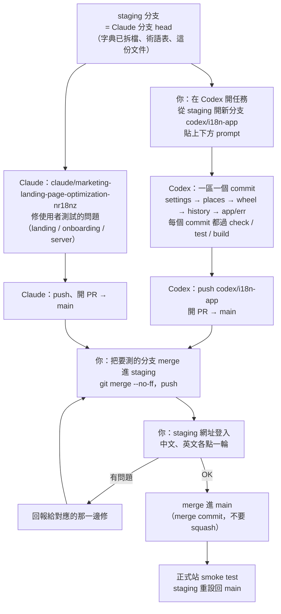

# 用 Codex 翻譯 app：流程

目標：把登入後的 app（BACKLOG.md 3a）翻成繁中優先、英文保留，並在 app 裡加上語言切換。
同一時間 Claude 在另一條分支修 2026-09-23 使用者測試的問題。兩邊要能**同時進行、不互相踩到**。

> **狀態（2026-09-23）：第一輪已完成。** Codex 的五個 commit 經 PR #38 進了 `staging`，
> Claude 分支已快轉到那裡並補完（見 BACKLOG 3a）。所以 Claude 的分支現在**包含** Codex 的翻譯，
> 合進 `main` 只要合這一條；PR #38 那條 fork 分支不用再另外合。下一輪若再分工，
> 從 Claude 分支的最新 head 開分支，並注意下面兩個這輪踩到的坑。
>
> - **沒列在表上的檔案等於沒人負責**：`StarRating.tsx`、`components/ui/*` 都不在表上，第一輪就一直是英文。
>   表外的檔案一律算 Claude 的，要翻就先來說。
> - **分支開出去之後才改的文件，對方看不到**：坑 9（`language: lang`）是 Codex 開分支後才加的，它讀到的版本沒有。
>   開始前寫完，或開始後改了就直接告訴對方。

## 整體流程



## 為什麼不會互相衝突

衝突只會發生在兩邊改到同一個檔案。所以**先分好誰擁有哪些檔案**：

| Codex 擁有（只改文字，不改行為） | Claude 擁有 |
|---|---|
| `client/src/pages/WheelApp.tsx`、`JoinWheel.tsx`、`GuestWheel.tsx`、`NotFound.tsx` | `client/src/pages/Home.tsx` |
| `client/src/components/` 裡的 `WheelSelector` `RestaurantTab` `NearbyDialog` `HistoryTab` `RestaurantStats` `TasteProfile` `SpinWheel`（**只有**看得到的字） `WinnerSurface` `FilterBar` `RoundPanel` `WheelMembers` `ConfirmDangerDialog` `StatusChip` `TabRail` `ThemeToggle` `ErrorBoundary` `BrandLoader` `Map` | `LandingWheel` `LangToggle` `LocationPicker` `OnboardingFlow` `components/onboarding/*` |
| `client/src/lib/placesError.ts` | `client/src/i18n/index.tsx`、`client/src/i18n/dict.ts` |
| `client/src/i18n/messages/` 的 `app` `wheel` `places` `history` `settings` `err` | `client/src/i18n/messages/` 的 `landing` `onboarding` `common` |
| | `server/**`、`shared/**`、`api/index.js`、`drizzle/**`、`client/index.html`、`client/src/index.css` |
| | **表上沒列的其他檔案**（例如 `StarRating`、`components/ui/*`、`lib/tagLabel.ts`、`lib/timeLabels.ts`） |

需要動到 server 的翻譯（例如新輪盤預設名稱 `Lunch near me` 是 server 產生的、Google 店名要改成中文要在 server 送 `language`）**由 Claude 做**，
因為 server 改動要重建並一起 commit `api/index.js`，這個規則只放在一邊比較安全。

字典已經拆成九個檔案（`client/src/i18n/messages/README.md`），app 的六個空檔案也已經先註冊好，
所以 Codex **完全不需要改 `dict.ts`**。每個檔案只能用自己的 key 前綴，打錯會在 `pnpm check` 失敗。

## 步驟

### 0. 準備（Claude，已完成）

- [x] 字典拆檔 + 前綴保護 + app 的空 namespace
- [x] 術語表 `docs/i18n/glossary.md`
- [x] 這份流程
- [x] 推到 `staging`

### 1. 開 Codex 任務（你）

在 Codex 選 `Piwison/lunch-spin`、分支選 `staging`，貼上「Codex prompt」那一節整段。

Codex 環境需要：Node 22、`corepack enable`（pnpm 版本由 `package.json` 的 `packageManager` 鎖在 10.4.1）、`pnpm install`。
**不需要資料庫**：`pnpm check` / `pnpm test` / `pnpm build` 都不連 DB。

### 2. Codex 做翻譯

一個區域一個 commit，順序：`settings` → `places` → `wheel` → `history` → `app` + `err` + app 內語言切換。
每個 commit 前都要過：`pnpm check && pnpm test && pnpm build`，還有 `pnpm lint` 不能多出 error。

### 3. 上 staging 測（你）

```bash
git fetch origin
git checkout staging
git merge --no-ff origin/codex/i18n-app     # 要一起測 Claude 的修正就再 merge 那條
git push origin staging
```

Vercel 約一分鐘後更新 staging。**用 staging 網址登入**，然後：

- 中文：每個 tab、每個對話框、轉一次、結果畫面、錯誤訊息（例如斷網再按）
- 右上角頭像選單切到英文，再點一輪
- 390px 寬的手機畫面：中文通常比英文短，英文比較容易撐破按鈕

### 4. 合併（你）

1. 先合 Claude 的分支進 `main`，再合 Codex 的（它的 PR 差異就只剩翻譯）。
2. 用 **merge commit**，不要 squash — 兩條分支共用一段歷史，squash 會讓後合的那條出現假衝突。
3. 合完正式站 smoke test，然後 `staging` 重設回 `main`（STAGING.md 有指令）。

## 已知的坑（先告訴 Codex）

1. **`AGENTS.md` 是 base64 編碼的一行。** Codex 會自動讀它，但讀到的是亂碼。
   要先 `base64 -d AGENTS.md` 才看得到專案規則。**不要修改 `AGENTS.md`。**
2. **`SpinWheel.tsx` 只能改看得到的字**（`in play`、`Spin the wheel`）。
   輪盤上的店名排版是這個專案重做最多次的地方（AGENTS.md 失敗模式 16、43、44、51），不要碰任何幾何、字級、截斷邏輯。
3. **不要改顏色 token。** 柿子橘文字 3.48:1 是業主看過後的決定（失敗模式 17、20），a11y 工具會報錯，這是已知的取捨。
4. **不要整檔 prettier。** 只格式化自己新增的內容（失敗模式 9）。
5. **Server 回來的錯誤是英文**：前端依 tRPC 的 error `code`（`FORBIDDEN`、`NOT_FOUND`、`PRECONDITION_FAILED`、`TOO_MANY_REQUESTS`…）
   對應到 `err.*`，不要去改 server 的訊息字串。`lib/placesError.ts` 已經有分類，改成回傳 key。
6. **資料不是 UI**：店名、輪盤名稱、資料庫裡的 tag 值不翻。tag 要顯示中文用對照表，存的值不動。
7. **英文複數**：`t()` 沒有複數規則，用 `.one` / `.other` 兩個 key 或改寫句子避開。
8. **日期、時間**：用 `Intl.DateTimeFormat(lang === "zh-TW" ? "zh-TW" : "en", …)`，不要自己拼字串。
9. **Google 店名的語言**：`places.searchNearby`、`places.searchPlaces`、`places.resolveLink` 都收 `language`，
   沒傳就是 zh-TW。你負責的 `NearbyDialog`、`RestaurantTab` 呼叫它們時請傳 `language: lang`（`useLang()` 的 `lang`），
   英文介面的人才會拿到英文店名。這是 client 端改動，不用碰 server。

## Codex prompt

複製下面整段貼給 Codex：

```text
You are translating the signed-in app of this repo (Lunch Wheel) into Traditional Chinese
first, English kept. Work on a NEW branch `codex/i18n-app` cut from `staging`. Never commit
to `staging` or `main` directly.

Before anything else:
1. AGENTS.md is stored base64-encoded on one line. Run `base64 -d AGENTS.md` and read the
   decoded text: it is the project's rules and known failure modes, and it applies to you.
   Do not edit AGENTS.md.
2. Read, in full: docs/i18n/codex-flow.md, docs/i18n/glossary.md,
   client/src/i18n/messages/README.md, client/src/i18n/index.tsx, and one finished example
   of the pattern: client/src/components/OnboardingFlow.tsx with
   client/src/i18n/messages/onboarding.ts.
3. `corepack enable && pnpm install`, then confirm `pnpm check && pnpm test && pnpm build`
   pass on the untouched branch.

Scope — only the files listed under "Codex 擁有" in docs/i18n/codex-flow.md. Do not modify
server/, shared/, api/index.js, drizzle/, client/index.html, client/src/index.css,
client/src/i18n/dict.ts, client/src/i18n/index.tsx, or any file listed under "Claude 擁有".
If a string can only be fixed there (for example a server-generated wheel name), list it in
your final report instead of changing it.

How:
- Replace every user-visible English string (JSX text, aria-label, title, placeholder,
  toast text, dialog copy) with `t("<prefix>.<key>")` from `useLang()` in "@/i18n".
- Put each string in the namespace file that owns that area (app / wheel / places /
  history / settings / err) with BOTH `zh` and `en`. Use the glossary's words and voice.
  Keep the existing English as the `en` value unless it is wrong.
- Text only: do not change behaviour, layout, class names, colours or animation.
  In SpinWheel.tsx change only visible strings — never label geometry, sizing or truncation.
- Errors from the server: map by tRPC error code in `err.*`; do not translate server text.
- Add an in-app language switch in the profile (avatar) menu that calls `toggleLang()`,
  using the existing `lang.switch` / `lang.label` keys.
- One commit per area in this order: settings, places, wheel, history, app + err + switch.
  Every commit must pass `pnpm check && pnpm test && pnpm build` and add no `pnpm lint`
  errors. Commit the regenerated api/index.js ONLY if `pnpm build` changed it (it should
  not, since you do not touch server/ or shared/).
- Format only what you changed; never run prettier over whole legacy files.

Done means: in every file you own, `grep -nE '>[A-Z][a-z]+[^<{]*<|"[A-Z][a-z]+ [a-z]+'`
finds no user-visible English left (data values like restaurant names excepted), all
checks pass, the branch is pushed, and a PR is open against `main` titled
"Translate the signed-in app (zh-TW first)" whose body lists: areas done, any strings you
could not translate and why, and every glossary term you added.
Reply to the user in Traditional Chinese.
```
