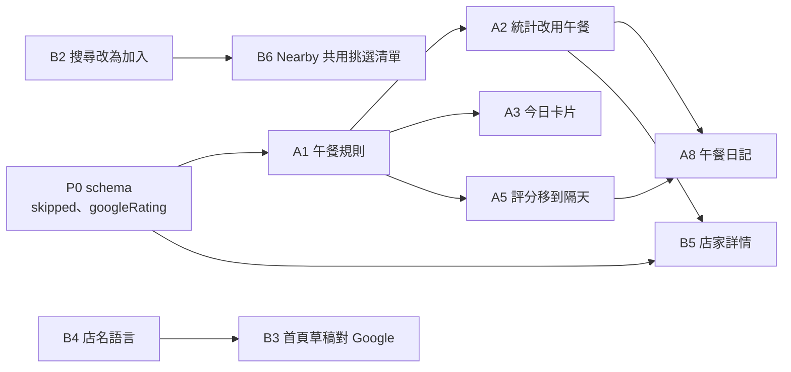

# 2026-09-24 走查後續：實作計畫

**來源**：`docs/user-tests/2026-09-24-walkthrough.md`（走查報告，含截圖與證據等級）、BACKLOG 第 7 節。
**狀態**：計畫定稿，可以開工。四個業主決策已定案（第 0 節）。只有 B8 在等決定；其他幾個小決定有預設值，不擋開工。
**怎麼用**：每個工作包（A1、B3……）是一個分支、一個 PR，可以單獨交給一個人或一個 agent。
開工前先讀第 0、1、2 節（決策、核心規則、分工），然後只讀自己那個工作包。
驗收步驟都能在本機複本上重現（`scripts/replica/README.md`），最後以 staging 為準（第 4 節）。

---

## 0. 決策紀錄

### 已定案（業主，2026-09-24）

| # | 問題 | 決定 | 對實作的意思 |
|---|---|---|---|
| 7a | app 怎麼知道「今天吃了哪家」 | **當天最後一次轉 = 午餐** | 不需要按任何按鈕。被 Respin 蓋掉的只排除今天。規則見第 1 節 |
| 7b | 一天可以有幾個「今天吃這家」 | **可以多個（分團吃）** | 今日卡片列出今天所有的決定，不阻擋再轉 |
| 7c | 「Use my location」建的輪盤沒有辦公室 | **建完問一次「存成辦公室？」** | 明確同意才存，隱私承諾保留 |
| 7d | 隊友轉的時候別人看到什麼 | **延後通知＋點開重播** | 通知等轉的人落定才出現，點開在自己的輪盤上重播同一個落點 |

**7a × 7b 的合併規則**（實作上的推論，不是另外的決定）：如果「輪盤當天最後一次轉」才算午餐，
第二團一轉，第一團的決定就被蓋掉了，和 7b 互相矛盾。所以午餐的單位是**「每個人」當天最後一次轉**。
Amy 自己重轉，會蓋掉她自己的上一個；Ben 轉，不會動到 Amy 的。詳細規則見第 1 節。

### 待決定（有預設值，可以先照預設做，merge 前業主可改）

| # | 問題 | 預設 | 擋住哪個工作包 |
|---|---|---|---|
| 7k / K2 | 否決（「Veto — not today」）和「Avoid today」目前**永不過期**，只有 Clear round 會清，而且會清掉別人的 | 否決、投票當天（台北時間）有效；「不吃牛」這類改成**個人的長期設定** | **B8**（沒定案前不要動） |
| C4 | 首次設定按「Spin these 8」後，要直接轉，還是把按鈕改名 | 直接轉 | A7 |
| — | 「Add starter restaurants」（Taco Truck 這類假店名） | 拿掉這個選項 | B9 的一小項 |
| — | 快關門的店，要剩多少時間才算來不及 | 剩餘營業時間 < 步行 + 20 分鐘 | A6（只是常數） |
| — | 公開連結 `/w/:id` 是給外人複製用，還是給沒帳號的隊友用 | 給外人：頁面標明「結果不會記錄，也不看團隊最近吃過的」 | B10 的一小項 |
| E4 | 本機 http 不能登入登出（`cookies.ts` 的 `SameSite=None` 沒有 `Secure`） | **不動**。這是 session 合約，要改先問（AGENTS.md「Hard stop」） | 不指派 |

---

## 1. 核心規則：什麼叫「一餐午餐」（所有人都要讀）

以前：`spin_history.accepted`（按 Lock it in）決定一次轉動算不算數。但大部分人不會按，
所以排除、紀錄、統計都失準（報告 P0-B）。

**現在：一次轉動是「午餐」，若且唯若**

1. 它沒有被標記為「沒去」（`skipped = false`，新欄位，見 P0），而且
2. 下面兩條至少一條成立：
   - 它被明確接受過（`accepted = true`，也就是按了「通知大家」）；
   - 同一個人、同一個輪盤、同一個台北日，**之後沒有再轉**。

不是午餐的轉動叫做「重轉掉的」（respun），只排除到那個台北日結束。
被標記為「沒去」的，不排除、不算進任何統計。

| 情境 | 結果 | 排除 |
|---|---|---|
| Amy 12:10 轉出 X，關掉結果 | X = 午餐 | X 排除 3 天 |
| Amy 轉出 X → Respin → Y | X 重轉掉、Y = 午餐 | X 只排除到今天結束；Y 排除 3 天 |
| Amy 轉出 Y，Ben 12:22 轉出 Z | Y、Z 都是午餐（兩團） | 各自排除 3 天 |
| Amy 按「通知大家」鎖定 X，之後又自己轉出 W | X、W 都是午餐（`accepted` 會釘住） | 都是 3 天 |
| 昨天 Amy 轉出 X，沒重轉 | X = 午餐（以前會被當成「拒絕」，隔天就回來） | 3 天 |
| 午餐 X 之後被標為「沒去」 | 不是午餐 | 不排除 |
| 手動「放回輪盤」（`manuallyReenabled`） | 還是午餐（有去吃），只是提早回到輪盤 | 不排除 |

**用到這條規則的地方**（全部要改成呼叫同一個 `shared/lunch.ts`，不准各自重寫，見 AGENTS.md 的 Pivot flags）：
排除（`computeExclusions`）、統計（`getRestaurantStats`）、公平模式的 `lastPickedAt`、料理輪替的歷史、
紀錄頁、今日卡片、「昨天吃了嗎」提示。

**上線時的一次性影響**：已經存在、但沒按 Lock it in 的轉動，只要是轉的人當天最後一次，都會變成午餐。
部署當下，最近 3 天內這類店會從「今天跳過」變成「排除到轉動後 3 天」。這是修正，不是 bug，
但要寫進 release note。

**`wheel-logic` skill 要跟著改**：它的第 1 條（同一家店只看最新一次轉動）不變；新增這條午餐規則。
順便修掉已經過期的描述：session 狀態在 `round_marks` 表，不在 `server/realtime.ts`；
權重條件已經包含評分（`hasRatings`）。

---

## 2. 分工與順序

### 兩條線

兩條線可以同時進行，因為**檔案不重疊**。表外的檔案一律算 A 線，B 線要動之前先說
（失敗模式 67：沒列在表上的檔案等於沒人負責）。建議 A 線給 Claude（會動到 `shared/` 規則和 server），
B 線給 Codex 或另一個 Claude session。

| | A 線：規則、今天、紀錄 | B 線：首次設定、店家、設定 |
|---|---|---|
| 擁有的檔案 | `shared/lunch.ts`（新）、`shared/exclusion.ts`、`shared/stats.ts`、`shared/wheelGeometry.ts`、`shared/openHours.ts`、`shared/spinBlock.ts`；`client/src/pages/WheelApp.tsx`、`WinnerSurface.tsx`、`SpinWheel.tsx`、`HistoryTab.tsx`、`RestaurantStats.tsx`、`TasteProfile.tsx`、`TodayCard.tsx`（新）、`RecentLunchPrompt.tsx`（新）；`client/src/i18n/messages/app.ts`、`history.ts`、`landing.ts`；`.claude/skills/wheel-logic/` | `client/src/components/OnboardingFlow.tsx`、`onboarding/*`、`LocationPicker.tsx`、`NearbyDialog.tsx`、`NearbyPicker.tsx`（新）、`RestaurantTab.tsx`、`WheelSelector.tsx`、`RoundPanel.tsx`、`FilterBar.tsx`、`GuestWheel.tsx`、`ui/switch.tsx`；`shared/nameMatch.ts`（新）、`shared/cuisineGuess.ts`（新）、`shared/candidates.ts`；`client/src/i18n/messages/onboarding.ts`、`places.ts`、`settings.ts` |
| 共用的檔案 | `server/routers.ts`、`server/db.ts`、`client/src/i18n/messages/wheel.ts`：兩邊都會改。**只改自己那一段**，新增的 i18n key 放在自己那條線的註解區塊下（`// ── A: today ──`／`// ── B: round ──`），不要都加在物件最後一行。 | |
| migration | **只有 P0 能新增 migration**。兩條線各自產生 migration，編號和 `drizzle/meta/_journal.json` 一定會衝突（`drizzle/meta/` 不能手改，見 AGENTS.md Prohibited #2）。 | |

`api/index.js`：兩條線都會改 server，每個 PR 都要附自己重新 build 的 bundle。
合併時如果 `api/index.js` 衝突，**不要手動解**：合完之後重跑 `pnpm build`，把結果 commit 上去。

### 開工前：基準分支和設計系統

- **從 `staging` 開分支**（`76a8e138` 或之後）。它除了這份計畫，也包含**設計系統分支**
  （Button / Chip / Badge 元件層，`docs/design-system/README.md`）。那個分支還在 staging 等驗收，還沒進 `main`。
  最乾淨的做法是設計系統先 merge 進 `main` 再開工；如果先開工，每個分支都會帶著它，
  `main` 要等設計系統先合進去，才能合這些工作包。
- **UI 一律用 `components/ui` 的元件**，不要在呼叫端寫新的 `style={{ minHeight / borderRadius / background }}`。
  `pnpm test` 裡有棘輪測試，手寫的 `var(--brand-grad)` 只能變少，新增一個測試就會失敗。
  下面幾個工作包直接對應到元件：
  - B7 的「想吃／今天不要」：`Chip`，用 `pressed` 同時決定外觀和 `aria-pressed`
  - A3 今日卡片的［Directions］：`Button variant="outline"`（在玻璃上）或 `secondary`（在地面上）
  - A11 的［就去這家］：`Button variant="primary"`
  - 44px 的按鈕：`size="md"`
- UI 變更也要走設計系統 README 第 6 節的檢查清單：`/design-system` 切深淺色看過；360、390、1280 寬都看過；
  `prefers-reduced-motion` 也要看。

### 順序

| 階段 | A 線 | B 線 |
|---|---|---|
| 0 | **P0**（半天，先合進 staging，兩條線都從它開分支） | ← 同左 |
| 1 | A1 → A2、A9（bug，隨時） | B4、B3、B1、B2 |
| 2 | A3、A4、A6、A7 | B5、B7、B9 |
| 3 | A5 → A8、A10、A11 | B6、B10、（B8 等決定） |

---

## 3. 工作包

每一包的格式：**對應**（報告的編號）／**目標**（使用者看得到的結果）／**做法**／**先寫的測試**／
**驗收**／**注意**。大小：S ≤ 半天、M 1–2 天、L 3 天以上。

### P0 — Schema（S，兩條線共用）

- **做法**：`drizzle/schema.ts` 新增三個欄位，全部可為 null 或有預設值，不刪不改名：
  - `spin_history.skipped` boolean，預設 false（「這次沒去成」，A5 用）
  - `restaurants.googleRating` decimal(2,1)，可為 null（B5 用）
  - `restaurants.googleRatingCount` int，可為 null（B5 用）

  用 `drizzle-kit generate` 產生 `0018_*.sql`，**先套到 staging DB**（STAGING.md），驗證方式是查欄位，
  不是查 `__drizzle_migrations`（失敗模式 50）：
  `SHOW COLUMNS FROM spin_history LIKE 'skipped'`。上線 DB 等 merge 進 `main` 之後再套。
- **驗收**：staging DB 上三個欄位都在；現有畫面行為不變；`pnpm check && pnpm test && pnpm build` 通過。

---

### A 線

#### A1 — 午餐規則（M）

- **對應**：P0-B、7a、7b
- **目標**：轉完直接去吃，那家店就會排除 3 天；重轉掉的明天就回來；兩團各自的決定互不影響。
- **做法**
  1. 新增 `shared/lunch.ts`：`classifySpins(rows)`，依第 1 節回傳每次轉動是 `lunch`、`respun` 或 `skipped`。
     台北日的計算（`taipeiDayIndex`、`endOfTaipeiDay`）從 `exclusion.ts` 搬過來並 export，兩邊共用。
  2. `shared/exclusion.ts`：`SpinRecord` 加 `id`、`spunBy`、`skipped`。先用 `classifySpins` 分類，
     再照原本的邏輯（同一家店只看最新一次）決定：`lunch` 排除到 `spunAt + windowDays`；
     `respun` 排除到那個台北日結束；`skipped` 不排除；`manuallyReenabled` 不排除。
  3. `server/db.ts`：`getExclusions` 多 select `id`、`spunBy`、`skipped`；`getSpinHistory` 多回傳 `accepted`、`skipped`
     （紀錄頁之後才分得出午餐和重轉）。
  4. 文案（`WheelApp.tsx`、`WinnerSurface.tsx`，i18n `app.ts`／`wheel.ts` 的 A 區）：
     - 結果卡：「三天內不會再轉到 X；按重轉的話，明天就會回來」。
       英文：「We'll skip X for 3 days — respin and it's back tomorrow.」
     - 「Lock it in」→ 共享輪盤「通知大家／Tell the team」（仍然呼叫 `spins.accept`，所以仍然會發通知）；
       個人輪盤「好／Sounds good」。
     - 紀錄頁「auto-excluded for 3 days after being spun」這句拿掉，A8 會重寫。
  5. 更新 `.claude/skills/wheel-logic/SKILL.md`（見第 1 節最後一段）。
- **先寫的測試**：`shared/lunch.test.ts` 把第 1 節的表格每一列寫成一個 case，再加上：
  - 台北午夜的邊界：23:59 轉出 X、00:01 轉出 Y，兩個都是午餐；
  - 同一秒兩次轉動：用 `id` 決定順序。

  `shared/exclusion.test.ts` 裡現有的「沒有 accepted → 只排除今天」測試，要改成「後面還有同一人同日的轉動」才只排除今天。
  這是規則變了，不是測試壞了。
- **驗收**（本機複本 R2，或 staging 兩個帳號）
  0. R2 剛開始、還沒人轉的時候，Skipping 名單**現在是 1 家**（這家炒飯，9/23 按了 Lock it in）；
     A1 之後要是 **2 家**，多出來的是 9/22 的定盒所（沒人按 Lock it in，但那是 Amy 當天最後一次轉）。
     9/21 的鵝肉担已經超過 3 天，兩種規則下都不在名單上。這是 2026-09-24 在 replica 上實際看到的數字。
  1. Amy 轉出 X 後關掉結果 → Skipping 名單顯示 X「3 天後回來」
  2. 再轉一次，Respin 得到 Y → X「今天結束回來」、Y「3 天」
  3. Ben 轉出 Z → Y 仍然是 3 天，Z 也是 3 天
- **注意**：`spins.create` 讀排除的那一波（wave B）不能多一趟 DB（失敗模式 52）。`spunBy` 在同一個 select 裡加欄位就好。

#### A2 — 統計、公平模式、料理輪替改用「午餐」（M，依賴 A1）

- **對應**：報告第 5 節（「Places tried 12/12」是錯的）
- **目標**：「去過幾家」「最常吃」「多久沒去」只算真的吃過的。
- **做法**
  - `shared/lunch.ts` 加 `lunchStats(rows)`：回傳每家店的 `lunchCount`、`lastLunchAt`，
    以及總計的 `lunchDays`（有午餐的台北日數）、`placesEaten`。
  - `getRestaurantStats` 的 raw SQL（`MAX(sh.spunAt)`、`COUNT`）改成讀一次歷史，再呼叫 `lunchStats`。
  - `spins.create`：公平模式的 `lastPickedAt` 改用 `lastLunchAt`；料理輪替只看午餐。
    沿用現有那一波的讀取，不能多一趟。
  - `shared/stats.ts` 的 `daysSinceLastPick` 加 `Math.max(0, …)`（報告 P2：使用者時鐘慢一點就會顯示 `-1d`）。
- **先寫的測試**：`lunchStats` 用 R3 的種子資料（三週）當 fixture，寫死答案：
  去過 11/12 家（八方雲集只被重轉掉過）、有午餐的天數 15。另外 `daysSinceLastPick` 輸入未來 2 秒要回傳 0。
- **驗收**：R3 資料下，紀錄頁顯示去過 11/12，八方雲集顯示「還沒吃過」。

#### A3 — 今日卡片（L，依賴 A1）

- **對應**：P0-A、7b
- **目標**：打開輪盤頁就知道今天吃哪裡、誰決定的、走幾分鐘、開到幾點。可以有好幾團。
- **做法**
  - Server：`shared/lunch.ts` 加 `todaysLunches(rows, now)`。新增 query `spins.today`，
    回傳 `{ spinId, restaurantId, name, spunBy, spunByName, spunAt, walkSeconds, openStatus, minutesUntilClose, mapUrl }[]`。
    共享輪盤把同樣的資料**併進 `wheels.realtime` 的回傳**，不要另外輪詢（失敗模式 61：請求數已經量過，不要增加）。
  - Client：新增 `TodayCard.tsx`，放在輪盤頁的輪盤上方，一團一列：店名、「Amy · 12:10」、步行、開到幾點、［Directions］。
    自己的那一列多一顆［重新決定］。
  - 開轉按鈕：如果我今天已經有決定，文字改成「重新決定（取代 賢明茶館）」，因為照第 1 節，它真的會取代。
    別人的決定不影響按鈕（7b：另一團）。
- **先寫的測試**：`todaysLunches`：跨午夜不算今天；同一人重轉只剩最後一個；兩個人兩列；`skipped` 不出現。
- **驗收**：R2，Amy 轉出並決定之後，Ben 打開 app，**不按任何東西**、3 秒內就看到 Amy 的那一列；
  Ben 轉出 Z → 兩列；Amy 按［重新決定］→ 只有她那一列換掉。
- **注意**：失敗模式 14。今日卡片不能去寫 `selectedWheelId`，也不能和輪盤的自動開啟邏輯搶同一個 state。

#### A4 — 隊友通知延後＋重播（M）

- **對應**：P0-D、7d
- **目標**：隊友不會比轉的人先知道答案；想看的人點一下，就在自己的輪盤上看到同一個落點。
- **做法**
  - `SpinWheel.tsx` 的時間常數（`MIN_LAND_TURNS`、`SETTLE_DEG`、`FREE_SPIN_SPEED`）搬到 `shared/wheelGeometry.ts`，
    export `SPIN_REVEAL_DELAY_MS`，代表轉的人從按下到落定的**上限**。
  - `WheelApp.tsx` 的 realtime effect（目前在約 615 行）：`now < latest.spunAt + SPIN_REVEAL_DELAY_MS` 時先不顯示 toast。
    toast 不寫店名：「Ben 轉出來了」＋［看結果］。
  - 點［看結果］重播：`SpinWheel` 以 `targetId = latest.restaurantId` 轉到那一格，然後用唯讀的 `WinnerSurface`
    （沒有接受、沒有重轉，只有 Directions）。**不呼叫 `spins.create`**：畫面只是播 server 已經決定的結果，
    client 沒有選任何東西（AGENTS.md Prohibited #4）。
  - 首頁 `features.3.desc` 改成和現況相符：「分享一個連結，誰轉的結果大家都看得到」。
- **先寫的測試**：`SPIN_REVEAL_DELAY_MS` ≥ 用 `decayDurationMs` 算出的最長落定時間（最多圈數 + settle），
  以後改轉盤曲線時，這個測試會攔住。
- **驗收**：R2，Ben 按開轉。記錄 Ben 結果卡出現的時間 t1、Amy toast 出現的時間 t2，t2 ≥ t1。
  Amy 按［看結果］，她的輪盤停在同一格；Amy 的 network log 裡沒有 `spins.create`。
- **注意**：失敗模式 51。**重播時那家店已經不在輪盤上了**（它一被抽中就被排除），
  所以重播要用「包含那家店」的清單，否則會轉到一格不存在的店。

#### A5 — 評分移到「隔天」＋「這次沒去成」（M，依賴 P0、A1）

- **對應**：P1-I、痛點 5
- **目標**：在吃過之後才問評分；app 知道哪幾次其實沒去。
- **做法**
  - 結果卡拿掉星星（`WheelApp` 傳給 `WinnerSurface` 的 extras）。
  - 新增 `RecentLunchPrompt.tsx`，放在輪盤頁最上面。內容是這個輪盤**前幾個台北日**（3 天內）最近一次的午餐，
    而且是我還沒評、還沒關掉的：「昨天吃了賢明茶館？★★★★★［我沒去］」。
    - 星星 → `restaurants.rate`
    - 「我沒去」→ 只是不再問我（存 localStorage，per-viewer）
    - 如果我就是那次轉動的人，多一個「這次沒去成」→ 新 mutation `spins.markSkipped`（只能標自己的轉動）→ `skipped = true`
  - 星星旁邊和 Team taste 卡片加一句：「評分高的店會比較常轉到」。這是真的（`applyStarWeights`），但以前沒人知道。
- **先寫的測試**：`shared/lunch.ts` 的 `promptableLunch(rows, now, viewerRatings)`：今天的不算；超過 3 天不算；
  評過的不算；`skipped` 不算。
- **驗收**：R3 資料（9/24 12:05）。Amy 打開 app，看到「昨天吃了這家炒飯？」（9/23 的午餐，Amy 還沒評過）。
  評分後提示消失、Team taste 的評分數 +1。標「這次沒去成」後，Skipping 名單不再有它，A2 的統計也會少一。

#### A6 — 快關門的店不上輪盤（S–M）

- **對應**：P1-M
- **做法**
  - `shared/openHours.ts` 加 `tooLateToGo({ minutesUntilClose, walkSeconds }, bufferMin = 20)`。
  - `spins.create` 在 server 端把它當成和「休息中」一樣的排除條件（invariant 4：server 重新驗證，不信任 client）。
  - `restaurants.list` 多一個 `tooLate` 旗標；輪盤說明文字寫「N 家快打烊」。
  - `shared/spinBlock.ts` 加 `closingSoon` 這一關，輪盤空掉時才講得出真正的原因（失敗模式 54）。
  - `shared/openHours.ts` 另外加 `closesAtLabel(periods, now, utcOffset)`（回傳「14:30」），給 A3 的今日卡片和 B5 的店家詳情用。
- **先寫的測試**：剩 5 分鐘、走 7 分鐘 → 來不及；剩 60 分鐘、走 7 分鐘 → 來得及；不知道營業時間 → 來得及；
  不知道步行時間 → 只看 buffer。`closesAtLabel`：一般情況、一天兩段營業、跨午夜、不知道營業時間。
- **驗收**：R2，時鐘設 12:20（`REPLICA_TIME`），台記（12:25 關門、走 7 分鐘）不在輪盤上，說明寫「1 家快打烊」；
  時鐘 11:00 時它在輪盤上。

#### A7 — 首次設定按下去就轉（S，C4 預設）

- **對應**：P1-G
- **做法**：OnboardingFlow 建立完成後帶一個一次性旗標（router state 或 sessionStorage），
  WheelApp 在新輪盤的清單載入完、而且沒有在轉的時候，自動轉一次。
  OnboardingFlow 那一行由 A 線加，事先和 B 線說好（這是 B 線的檔案）。
- **驗收**：從挑選清單按「Spin these 8」，一次就看到結果。
- **注意**：失敗模式 14、51：旗標只能用一次；清單還在載入時不能轉。

#### A8 — 紀錄頁改成「午餐日記」（L，依賴 A1、A2、A5）

- **對應**：報告第 5 節
- **目標**：最上面就是「哪天吃了什麼」，統計縮成一行。
- **做法**（`HistoryTab.tsx`、`RestaurantStats.tsx`、`TasteProfile.tsx`）
  - **日記**：依台北日分組，最新的在上面，日期標題寫「週二 9/15」，每週一條分隔線。
    每天一到多列午餐（7b）：「定盒所 · Ben 11:52 · ★4.5」；重轉掉的店用小字附在下面：「重轉掉：八方雲集、鵝肉担」。
    評分放在午餐那一列。
  - **摘要一行**：「3 週 · 15 天有決定 · 去過 11/12 家」。
  - **刪掉**：Total spins、依次數算的 Favourite、Most picked、Who's been picking。
  - **保留**：Team taste、Team favourites。
  - **改**：「該回訪了」的 chip 可以點，點了等於在今天的輪次**投它一票**（沿用 `applyVoteWeights`），
    toast「今天比較容易轉到火鍋 106」。
  - 列號 1–23 拿掉；Re-enable 改名「放回輪盤」。
- **驗收**：R3 資料下，第一個畫面就看得到最近三天的午餐和日期。9/15 顯示定盒所，下面小字是八方雲集、Goose Meat Dan。
  畫面上沒有「Total spins」。點「火鍋 106」後，今天的投票裡出現一票。

#### A9 — 複製輪盤的步行時間（S，bug，隨時可以做）

- **對應**：P1-L
- **做法**：`wheels.copy` 把辦公室位置一起複製時，`walkSeconds` 也一起複製（同一個起點，數字一樣，不用再打 Distance Matrix）。
  `copyWheelRestaurants` 加 `copyWalkSeconds` 參數。它的註解說「讓呼叫端重算」，但從來沒有呼叫端重算，這段註解要一起改掉。
- **驗收**：複製一個有開距離模式的輪盤，每家有位置的店步行時間都和原本一樣；步行上限的篩選不會變空。

#### A10 — 刪帳號前先轉移團隊輪盤（M）

- **對應**：P1-P
- **做法**
  - Server：query `account.ownedTeamWheels`（我擁有、而且還有其他成員的輪盤）。
    mutation `wheels.transferOwnership({ wheelId, toUserId })`：只有擁有者能呼叫，對方必須是成員。
    這個 schema 沒有任何 foreign key（失敗模式 15、36），所以要自己寫出動到的每一張表：
    - `wheels.ownerId` 改成對方；
    - 原擁有者新增一筆 `wheel_members`，保留成員身分；
    - 對方原本那筆 `wheel_members` 移除（擁有者不存成員列，要和 `createWheel` 的慣例一致，動手前先確認）。
  - UI（刪除帳號的對話框）：列出「還有其他成員的輪盤：Lunch near Ruiguang Rd（Ben）［交給 Ben］［一起刪除］」，
    每一個都要選過，才能按刪除。
- **驗收**：R2，Amy 把輪盤交給 Ben，然後刪除帳號。Ben 仍然看得到輪盤和三週紀錄，而且可以改設定。

#### A11 — A 線小項（S）

- 只剩 1 家符合時，不顯示「Spin the wheel」，改成「只有 Goose Meat Dan 符合 ［就去這家］」。
  按下去記成一次轉動，server 仍然用 `spins.create` 決定（清單只有一家）。
- 帳號選單「star one in the sidebar」改成手機上找得到的說法：「在輪盤清單點 ☆」。
- Skipping 名單的「Now」改成「放回輪盤」。
- 手機輪盤頁的標題列放齒輪（設定）按鈕（P1-J）；目前只有 Places、History 分頁有。
- 找出 console 報「`DialogContent` requires a `DialogTitle`」的那個對話框，補上 title（可以是 visually hidden）。
  如果它在 B 線的檔案（例如 `WheelSelector.tsx`），告訴 B 線，由 B9 順手修。

---

### B 線

#### B1 — 建完問「存成辦公室？」（S–M）

- **對應**：P0-C、7c
- **做法**（`OnboardingFlow.tsx`）
  - 起點是「Use my location」（不是 LocationPicker 搜尋來的）時，`createFromNearby` 成功之後多一步：
    「把剛剛的位置存成辦公室？每家店都會顯示步行時間，隊友也看得到。」［存成辦公室］［不要］
  - 按［存成辦公室］→ 呼叫現有的 `wheels.setDistanceOrigin`（會重算每家店的步行時間），label 用「辦公室／Office」。
  - 「Use my location」下方的隱私文案改成：「只用來搜尋；要不要存成辦公室，建好之後再問你」。
- **驗收**：R1，Use my location → 建立 → 存 → 店家頁每家都有「2 分鐘」這類時間，輪盤頁出現篩選按鈕。
  選［不要］→ DB 裡 `wheels.originLat` 是 NULL。

#### B2 — 首次設定的搜尋改成「加入」（M）

- **對應**：P1-E
- **做法**
  - 每個搜尋仍然有自己的結果池（失敗模式 65 的修正要保留）。
    但勾選改成一個**全域的「已選」集合**，以 placeId 為 key。
  - 只有基本清單第一次出現時，會自動勾最近的 N 家（加上首頁帶來的草稿）；**搜尋結果永遠不自動勾**。
    這一點就是失敗模式 65 的原因。
  - 按鈕數字 = 已選集合的大小。按鈕上方加「已選 N」的 chip 列，可以直接移除。
    畫面上看不到的已選店家，也會出現在這一列，所以「按鈕數字和畫面一致」的規則（失敗模式 38、54）仍然成立。
  - 同步改 `OnboardingFlow.tsx` 開頭註解裡的規則描述。
- **先寫的測試**：勾選邏輯放在 `shared/candidates.ts`（已經有 `arrivalTicks`），寫這幾個 case：
  搜尋不改變數字；勾搜尋結果會 +1；Back to all 之後數字不變；取消已選列裡的 chip 會 −1。
- **驗收**：R1，已選 7 → 搜尋 noodle → 按鈕還是 7 → 勾台記 → 8 → Back to all → 還是 8，已選列裡有台記。

#### B3 — 首頁帶來的店對上 Google（S–M，建議在 B4 之後）

- **對應**：P1-F
- **做法**
  - 新增 `shared/nameMatch.ts`：正規化（NFKC、小寫、去空白和標點、去掉分店字尾，例如「內湖店」）。
    規則：一邊包含另一邊，而且中文至少 2 個字、英文至少 4 個字母，就算同一家。
  - OnboardingFlow 拿到清單後，對上的草稿改成勾那家 Google 店，草稿卡片顯示「已對到 Google 上的『這家炒飯J+』」，
    這筆不再當 `extraNames` 送出。
- **先寫的測試**：
  - 「這家炒飯」≈「這家炒飯J+」
  - 「八方雲集」≈「八方雲集 內湖店」
  - 「麥當勞」≈「麥當勞 內湖科技園區店」
  - 「鵝肉担」≉「Goose Meat Dan」：不同文字系統對不上，所以要 B4 讓店名回來是中文
  - 「麵」≉「台記家傳手勁麵」：太短，不算
- **驗收**：R1，首頁加「這家炒飯」→ 登入 → 輪盤上只有一格「這家炒飯J+」，而且有步行時間。

#### B4 — 店名語言跟手機，不跟介面（S）

- **對應**：P1-H（預設英文的連帶影響）
- **做法**
  - Client 送給 Places 的 `language` 改成依 `navigator.language`：`zh*` → `zh-TW`，其他 → `en`。
    涵蓋 onboarding、LocationPicker、NearbyDialog、店家頁的名稱搜尋。Server 不用改，已經接受 `language`。
  - 新輪盤的自動名稱用同一個語言，因為它是從同一批地址推出來的。
  - `docs/i18n/codex-flow.md` 的坑 9（Places 跟介面語言）標註「已由 B4 取代」；BACKLOG 5a 也補一句。
- **驗收**：中文手機、英文介面 → 首次設定列出「八方雲集」「鵝肉担」；英文手機 → 英文店名。

#### B5 — 店家列表與詳情補齊資訊（M，依賴 P0；「上次吃」依賴 A2）

- **對應**：P1-N
- **做法**
  - Server：`addNearbyPlaces`／`addProviderRestaurants` 從搜尋結果存 `rating`、`user_ratings_total`。
    營業時間更新（Place Details）的 fields 也加上這兩個欄位，舊資料會隨時間補齊。
  - 列表每一列：「★4.3 · $ · 3 分鐘 · 開到 14:30」。
  - 詳情：地址、Google ★（評論數）、開到幾點、步行、上次吃（A2 的 `lastLunchAt`）。
  - 「開到 14:30」用 `closesAtLabel`（由 A6 加在 `shared/openHours.ts`，那是 A 線的檔案）。A6 還沒 merge 的話，先顯示「還有 N 分鐘」。
- **先寫的測試**：無新的 shared 邏輯（Google 評分只是存與顯示）；驗收靠畫面。
- **驗收**：R3，Goose Meat Dan 的詳情顯示「★4.3 (812) · $ · 2 分鐘 · 開到 14:30 · 上次 9/8」。

#### B6 — 店家頁「Nearby」改用首次設定的挑選清單（L，依賴 B2）

- **對應**：P1-O
- **做法**：從 `OnboardingFlow.tsx` 抽出 `NearbyPicker.tsx`（結果池、篩選 chip、低分隱藏、Look farther、PlaceCard），
  `NearbyDialog.tsx` 改用它，已經在輪盤上的店標「在輪盤上」。拿掉打開就聚焦的空輸入框。
- **驗收**：R1，店家頁 Nearby 有評分，低於 3.0 的隱藏並顯示數量，Look farther 可以用。
  老張牛肉麵（2.8）預設看不到。

#### B7 — 「This round」改版（M）

- **對應**：P1-K
- **做法**（`RoundPanel.tsx`，i18n `wheel.ts` 的 B 區）
  - 名稱改成「今天的投票／Today's votes」。標題旁的數字拿掉，只留輪盤說明那一個數字（A 線），避免同一個畫面出現四個數字。
  - 料理 chip 只顯示**輪盤上有店的料理**；一個都沒有時，整列不顯示，改成一個連結：「幫店家加上料理，才能用『今天不想吃』」。
  - 新增 `shared/cuisineGuess.ts`：依店名關鍵字猜料理標籤（韓／Korean → Korean、拉麵／壽司／ramen → Japanese、
    泰 → Thai、越南／河粉／pho → Vietnamese、麵／noodle → Noodles、漢堡／burger → Burgers、咖啡／cafe → Cafe……）。
    Server 從 Google 加店時當作**建議標籤**寫入，使用者可以改。
  - 投票／否決改成有文字的按鈕（「想吃」「今天不要」），至少 44×44，旁邊顯示是誰投的（姓名縮寫）。
- **先寫的測試**：`cuisineGuess`：每個關鍵字一個 case；「火鍋106」不應該被猜成 Korean；沒有關鍵字 → null。
- **驗收**：R2，「Korean」chip 只有在輪盤上有韓式店時才出現。從 Nearby 加入「Seoul Korean Kitchen」（R1 的假資料裡有）→
  自動帶 Korean → 勾「今天不想吃 Korean」會把它移出輪盤；否決按鈕用 `getBoundingClientRect` 量，高度 ≥ 44。

#### B8 — 否決當天有效＋個人飲食偏好（L，**等 7k／K2 決定，先不要動**）

- **對應**：P1-K2
- **預設方案**
  - `round_marks` 加 `createdAt`（另開一個 migration，排在 P0 之後）。投票、否決只算今天（台北日）。
  - 「不吃牛」這類改成個人設定（新表 `user_dietary(userId, tagId)`），這個人在線上（presence）時套用。
  - 「Clear round」只清投票和否決，不清別人的飲食偏好。
  - `wheel-logic` 的 invariant 7 要跟著改。

#### B9 — 建立／設定對話框（S–M）

- **對應**：P2
- **做法**（`WheelSelector.tsx`、`ui/switch.tsx`）
  - 每一個 switch 列整列可以點：`<label htmlFor>` 加 switch 的 `id`，整列高度 ≥ 44px。
  - Fairness mode、Rotate cuisines、Distance mode 下面各加一行說明。
  - 設定對話框不要自動全選名稱：`onOpenAutoFocus={(e) => e.preventDefault()}`。
  - 開啟共享後跳出的「Invite link」對話框，加上分享按鈕（沿用 `shareInviteLink`，也就是 `navigator.share` → LINE）。
  - 拿掉「Add starter restaurants」（預設；待決定）。
  - toast「6 located, 2 skipped」改成「6 家算好步行時間，2 家沒有位置」。
  - 桌面版側欄的輪盤名稱不要被截成「Lun…」：名稱 `flex-1 min-w-0`，圖示不要佔掉名稱的寬度。
- **驗收**：點「Fairness mode」這幾個字就會切換；1280×800 下側欄看得到完整的「Lunch near Ruiguang Rd」或合理的截斷。

#### B10 — B 線小項（S）

- 「Hid 1 places」的單複數（`onboarding.ts`）。
- 暫停營業（`CLOSED_TEMPORARILY`）的店不要顯示「Closed now」，改成「暫停營業」。
  先確認 server 有沒有把 `business_status` 傳到 client，沒有的話要補（碰到 server，算這一包的範圍）。
- `GuestWheel.tsx`：頁首加產品名稱，並寫一行「這裡轉的結果不會記錄，也不會避開團隊最近吃過的」（公開連結預設是給外人）。

---

## 4. 每個工作包都要過的關（AGENTS.md「Definition of done」摘要）

1. `pnpm check && pnpm test && pnpm build` 全部通過。有新規則的，**先寫 `shared/*.test.ts`**。
2. 動到 `server/` 或 `shared/` 的，重新 build 的 `api/index.js` 放在同一個 commit。
3. 只有 P0 有 migration，而且要先套到 staging DB，再套上線 DB，用查欄位確認。
4. 分支 `claude/<topic>` 或 `codex/<topic>`。合進 `staging` 用 `git merge --no-ff`。
   在 staging 網址用真的 Google 帳號登入，中英文各點一輪，390×844 和 1280×800 都要看。
5. staging 沒問題才 merge 進 `main`（merge commit，不要 squash），約 1 分鐘後到正式站 smoke test。
6. 畫面相關的驗收，要在真的瀏覽器裡量計算後的值（`getComputedStyle`、`getBoundingClientRect`），不是讀原始碼
   （失敗模式 25）。

## 5. 驗收用的本機複本

`scripts/replica/` 有走查用的整套工具：假的 Google Places、MariaDB、對齊的假時鐘、多人的瀏覽器驅動、三週的種子資料。
上面寫的 R1–R3 是那裡的腳本：

- **R1 新使用者**：首頁 → 登入 → 首次設定
- **R3 三週紀錄**：15 個工作天、20 次轉動（含重轉）、9 個評分，數字固定；「今天」是空的
- **R2 團隊的一天**建立在 R3 的資料上：Amy（擁有者）和 Ben（成員）都已登入，時鐘 12:05（`REPLICA_TIME` 可改）

多人流程在 staging 上需要兩個 Google 帳號，本機複本比較方便。
但本機複本和 staging 有已知的差異（失敗模式 71），**最後仍以 staging 為準**。

## 6. 這一輪不做

- 真正同步一起轉（7d 選的是重播）
- 推播通知、LINE bot
- 午餐花費記錄
- 輪盤標籤重新設計（Claude Design 那邊在做，失敗模式 16）
- SEO（BACKLOG 第 2 節，等自訂網域）
